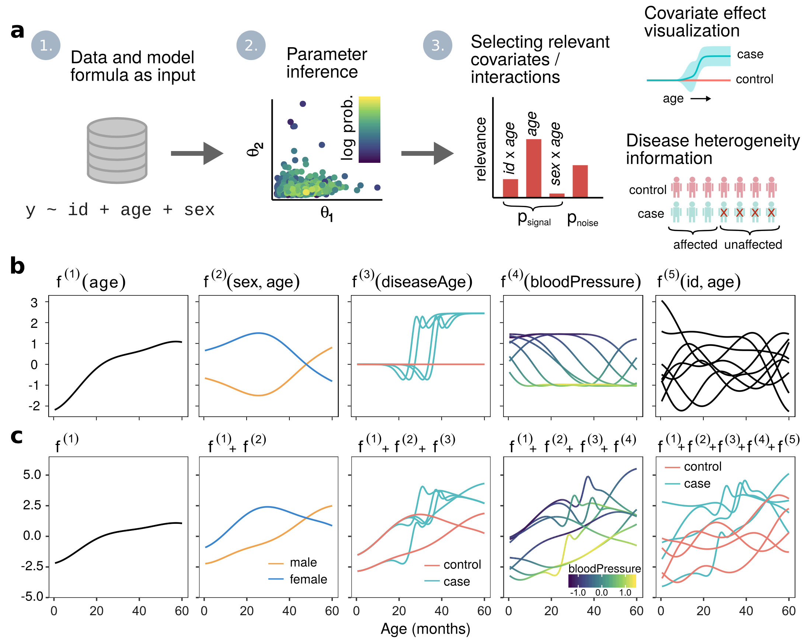

- The lgpr package https://jtimonen.github.io/lgpr-usage

- Best resource for understanding completely is [1]:

- This lecture provides an overview

 
<a href="04_gp_4.html" class="previous">&larr; Previous</a>
<a href="05_lgp_2.html" class="next">Next &rarr;</a>
 
 

[1] Juho Timonen, Henrik Mannerström, Aki Vehtari and Harri Lähdesmäki (2019). An interpretable probabilistic machine learning method for heterogeneous longitudinal studies. https://arxiv.org/abs/1912.03549