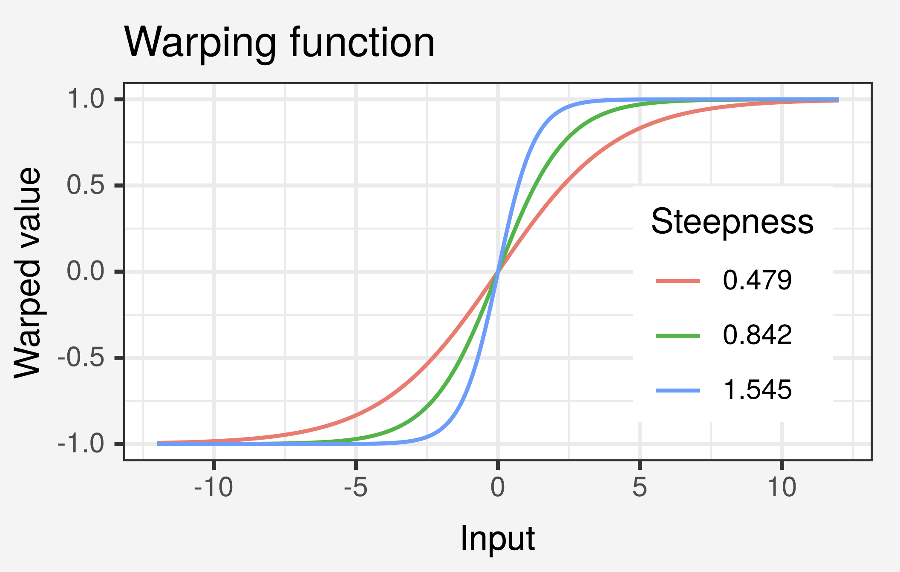

- Disease effects can be modeled using a nonstationary kernel for the disease-related age $x_{\text{disAge}}$, i.e. time from disease initiation or onset. 

- This is motivated by the assumption that most changes in that function component occur near the event of disease occurrence, i.e. near $x_{\text{disAge}} = 0$. 

- Nonstationarity is achieved by first mapping the inputs through a monotonic nonlinear input warping function
$$
    \omega(x) = 2 \cdot \left(\frac{1}{1 + e^{-a x}} - \frac{1}{2} \right)
$$
where the parameter $a$ controls the warping steepness

- Then exponentiated quadratic kernel is then used for the warped inputs

 
<a href="05_lgp_5.html" class="previous">&larr; Previous</a>
<a href="05_lgp_7.html" class="next">Next &rarr;</a>
 
 

