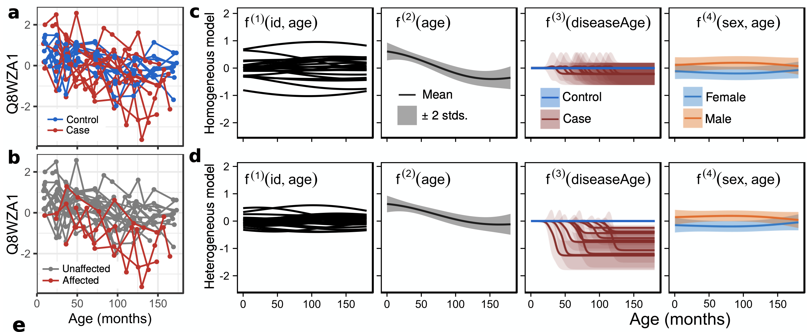

- Data and inferred components for one protein in the data of @liu2018

 
<a href="05_lgp_8.html" class="previous">&larr; Previous</a>
<a href="06_res_2.html" class="next">Next &rarr;</a>
 
 

##### References