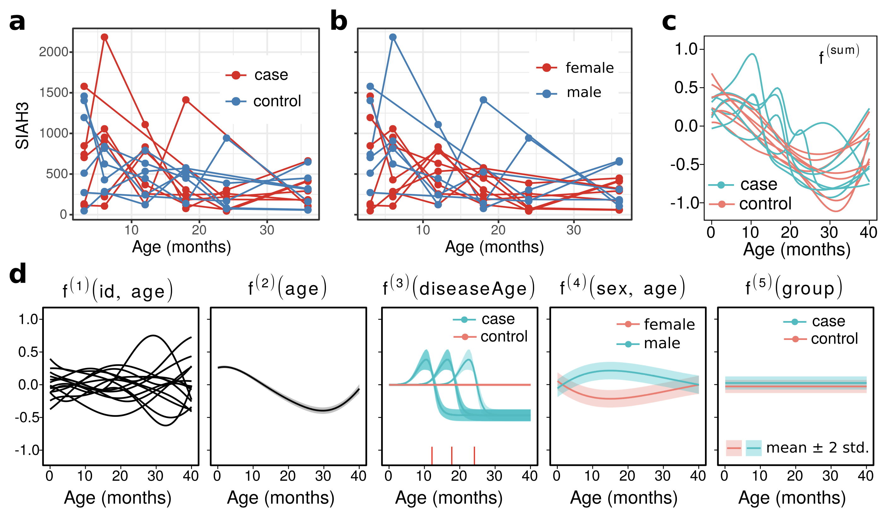

- Data and inferred components for one gene in the data of @kallionpaa2019

 
<a href="06_res_1.html" class="previous">&larr; Previous</a>
<a href="06_res_3.html" class="next">Next &rarr;</a>
 
 

##### References